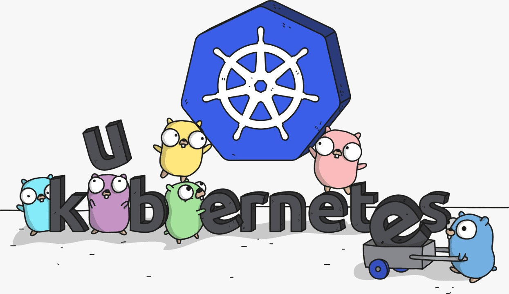

# **K8s-API**
[](https://github.com/GDSC-DSI/Schedura/graphs/contributors) [](https://github.com/kitarp29/k8s-api/issues/) 
 

This is a simple k8s-api project. It is built on **Golang** and utilises the **client-go** library to interact with Kubernetes API. It is also built on **Docker**.
</img>

```
kubectl apply -f - <<EOF 
apiVersion: v1
kind: Pod
metadata:
  name: k8s-api
spec:
  serviceAccount: k8s-api
  containers:
  - name: k8s-api
    image: kitarp29/k8s-api:2.0
    ports:
    - containerPort: 8000
EOF
```

